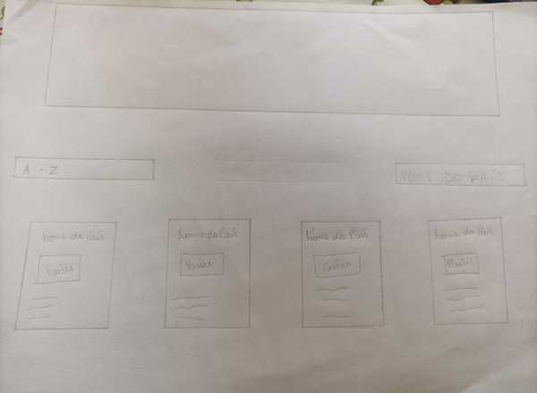

# Data Lovers

## Índice

 - 1. Resumo do projeto
 - 2. História do usuário
 - 3. Desenvolvimento do Site
 - 4. Teste de Usabilidade
 - 5. DTecnologias
 - 6. Desenvolvedoras

1. ## Resumo do Projeto

   Data Lovers é um guia para os mochileiros apaixonados.
   A aplicação web foi desenvolvida em dupla durante o bootcamp da Laboratória.

2. ## História do usuário

   Nós construimos neste projeto uma página Web Mochileiros que permite ao usuário pesquisar países que ele queira conhecer para fazer trila e cultura da sua escolha.

   O usuário poderá filtrar por continentes e por paises que tem ou não sua indepencia declarada, através de um banco de dados de pesquisas geográficas. Ao filtrar o continente, ele conseguirá visualizar cards com a seguintes informações do país: Nome do país e quantidade da população e até mesmo a imagem para saber mais sobre o país que deseja conhecer.

3. ## Desenvolvimento do Site

   O processo de criação foi pensado buscando um layout intuitivo e de fácil compreensão, que mostrasse apenas as informações principais.

   Iniciamos com protótipo de baixa fidelidade, para colocar nossas idéias e entender o que gostaríamo de criar. (Protótipo de Baixa Fidelidade)
   

   Depois utilizamos a ferramenta Figma para desenhar o protótipo de Alta Fidelidade para ficar mais próximo do que queriamos no nosso site. Foi um processo de aprendizado, no começo um pouco confuso, mas depois de aprender melhor utilizar o Figma e suas funcionalidades se tornou uma ferramenta indispensável. (Protótipo de Alta Fidelidade)
   

   Utilizamos DOM, objetos, arrays, uso de condicionais e CSS para ficar mais interessante para o usuário. Também tivemos necessidade usar o trello para nos organizar para não nos perder durante o processo e concluir o projeto.

4. ## Teste de Usabilidade

   De acordo com os resultados dos testes de usabilidade para melhor visibilidade, alteramos tamanho e cor das fontes dos campos filtrar a fim de deixar a experiência do usuário mais intuitiva.

5. ## Tecnologias

   Javascript
   CSS3
   HTML5
   Node.js
   Git
   GitHub
   VsCode
   Figma

6. ## Desenvolvedoras
   Este projeto foi desenvolvido por:

   Daniele Maria : <a href="linkedin.com/in/daniele-maria-7b8476217" target="_blank" alt= "link linkedin">Linkedin</a>
   <a href="https://github.com/Danima-dev" target="_blank" alt= "link github">GitHub </a>
   Priscila Freitas: <a href="https://www.linkedin.com/in/priscila-freitas-35971497/"  target="_blank" alt= "link linkedin">Linkedin</a>
   <a href="https://github.com/cilafreitas" target="_blank" alt= "link github">GitHub</a>
