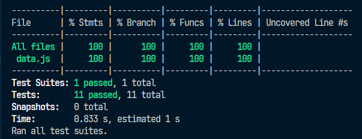

# Data Lovers - Breaking Bad

Clique aqui para acessar o projeto.

## Índice

- [1. Resumo do projeto](#1-resumo-do-projeto)
- [2. Histórias de usuários](#2-histórias-de-usuário)
- [3. Desenho de interface do usuário](#3-desenho-de-interface-do-usuário)
- [4. Testes de usabilidade](#4-testes-de-usabilidade)
- [5. Testes unitários](#5-testes-unitários)
- [6. Ferramentas utilizadas](#6-ferramentas-utilizadas)
- [7. Objetivos alcançados](#7-objetivos-alcançados)
- [8. Desenvolvedoras](#10-desenvolvedoras)

---

## 1. Resumo do projeto

Desenvolvido no bootcamp da [Laboratória](https://www.laboratoria.la/br), o projeto Data Lovers teve como objetivo principal a construção de uma página web que permitisse ao usuário visualizar dados, filtrá-los, ordená-los e fazer algum cálculo agregado, conforme a sua necessidade.

O tema escolhido foi Breaking Bad, e o site é destinado aos fãs da série. Nele, os fãs podem fazer pesquisas sobre os seus principais personagens,

## 2. Histórias de usuário

**História do usuário 1:**
_"Sou um fã da série, e gostaria de saber que personagens aparecem nas duas séries (Breaking Bad e Better Call Saul), e quais só aparecem em uma delas."_

A partir desta necessidade do usuário, foi criado o filtro por séries, no qual ele pode selecionar os personagens buscando pelas séries em que atuam.

**História do usuário 2:**
_"Como fã da série, gostaria de relembrar quais personagens ainda estão vivos e quais não estão mais."_

A partir desta história, foi criado o filtro por status, que retorna quais personagens estão vivos e quais estão falecidos ou presumidamente falecidos.

## 3. Desenho de interface do usuário

O protótipo do site foi feito primeiramente à mão, para que, posteriormente, pudesse ser feito na plataforma Figma. Houveram algumas adequações ao longo do projeto para que houvesse uma melhor experiência do usuário. Por exemplo, os filtros foram adequados para que o usuário pudesse navegar mais facilmente entre eles:

#### Protótipo de baixa fidelidade

Os filtros de "apelido", "ocupação" e "status" foram substituídos por "status" e "série". Os dois últimos correspondem a um número maior de personagens, permitindo ao usuário fazer uma busca que fosse mais abrangente. Além disso, o filtro por séries permite ao usuário ver em quais séries o personagem atua. Veja os protótipos abaixo, feitos no Figma:

#### Protótipo de alta fidelidade versão desktop

#### Protótipo de alta fidelidade versão mobile

## 4. Testes de usabilidade

Em um primeiro momento, foi pensado em

## 5. Testes unitários

Conforme estabelecido no Projeto os testes unitários devem ter cobertura mínima de 70% de statements (sentenças), functions (funções), lines (linhas), e branches (ramos) do arquivo src/data.js, que irá conter as funções, o nosso projeto cobriu 100%.

Lembrando que todos os teste foram escritos por nós.

## 6. Ferramentas utilizadas

- [Git](https://git-scm.com/)
- [GitHub](https://github.com/)
- [GitHub Pages](https://pages.github.com/)
- [Node.js](https://nodejs.org/)
- [Jest](https://jestjs.io/)

## 7. Objetivos alcançados

- [x] Usar VanillaJS.
- [x] Passa pelo linGIter (`npm run pretest`)
- [x] Passa pelos testes (`npm test`)
- [x] Testes unitários cobrem um mínimo de 70% de statements, functions, lines e
      branches.
- [x] Inclui uma _definição de produto_ clara e informativa no `README.md`.
- [x] Inclui histórias de usuário no `README.md`.
- [x] Inclui rascunho da solução (protótipo de baixa fidelidade) no `README.md`.
- [ ] Inclui uma lista de problemas detectados nos testes de usabilidade no
      `README.md`.
- [x] UI: Mostra lista/tabela/etc com dados e/ou indicadores.
- [x] UI: Permite ordenar dados por um ou mais campos (asc e desc).
- [x] UI: Permite filtrar dados com base em uma condição.
- [ ] UI: É _responsivo_.

## 8. Desenvolvedoras

Geane Ramos

 

Marina Braz

 
