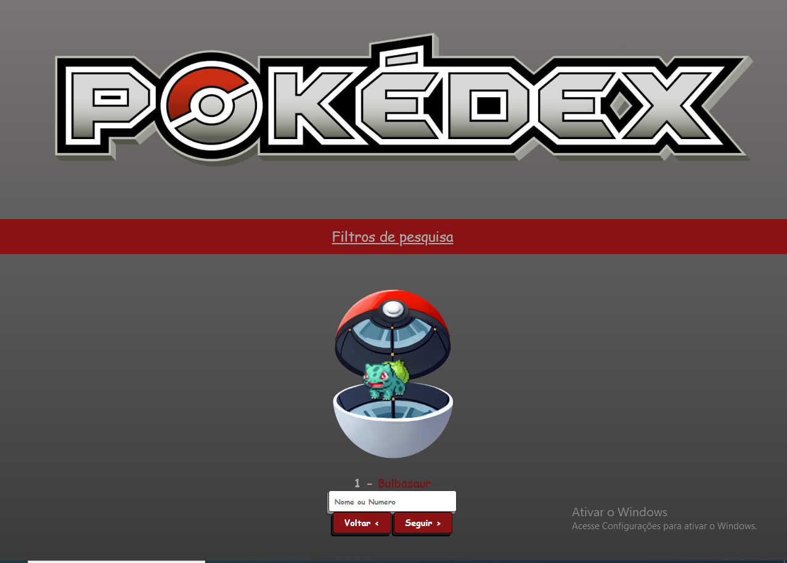
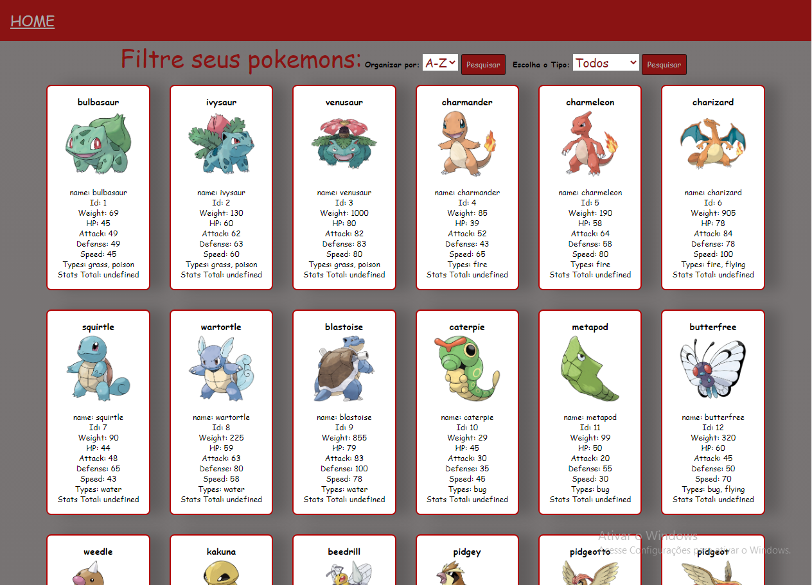
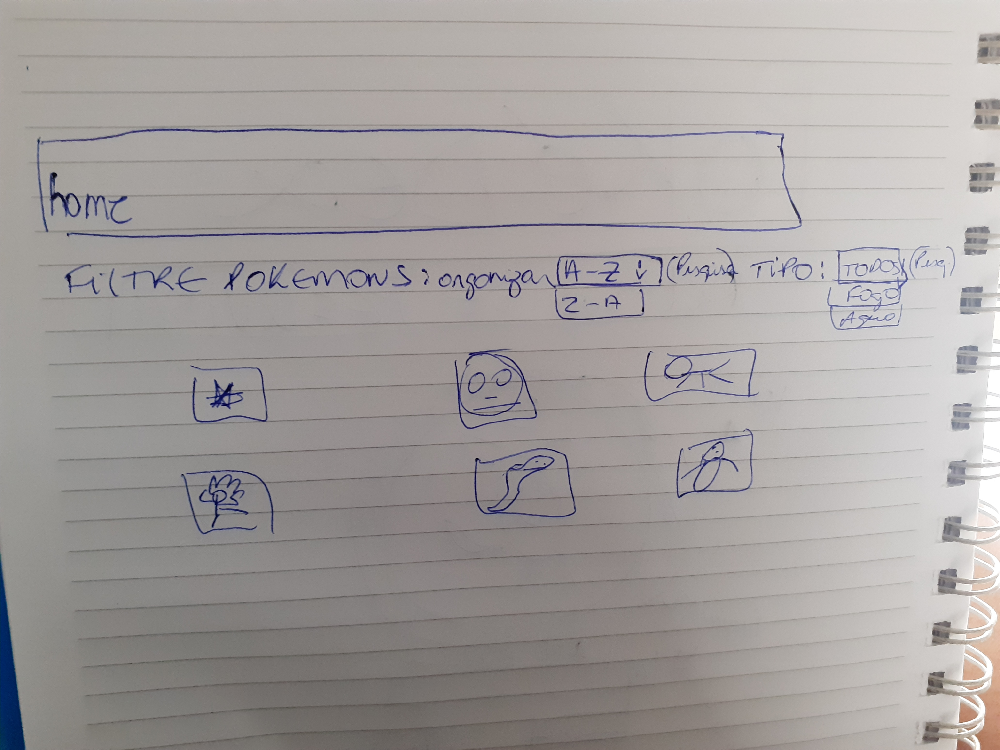
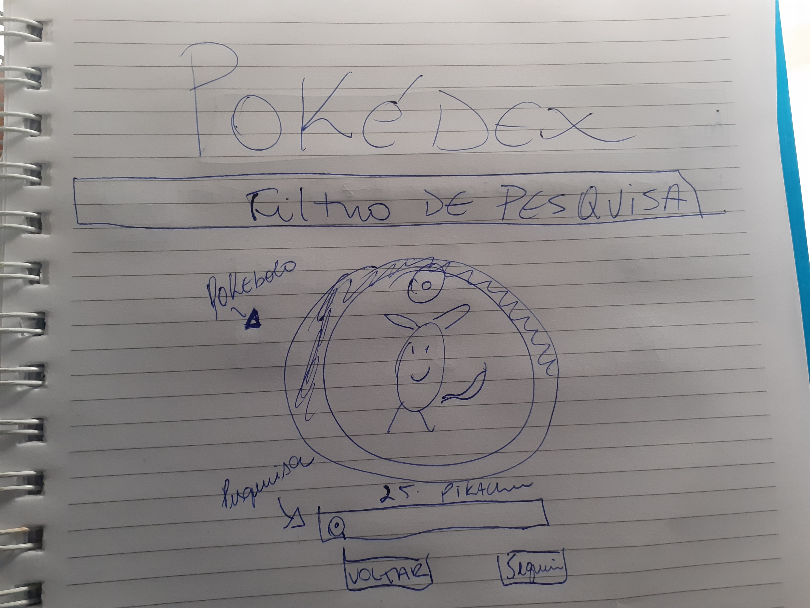
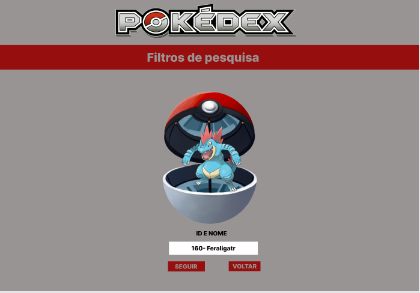
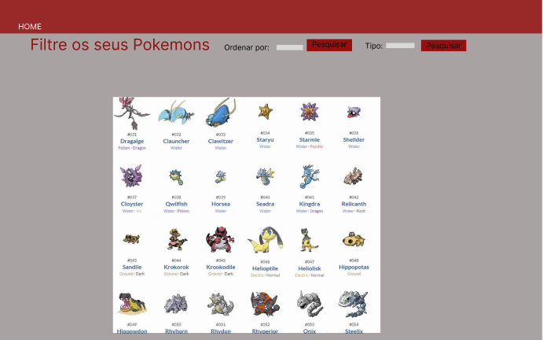

# Data Lovers

## Índice

* [1. Prefácio](#1-prefácio)
* [2. Resumo do projeto](#2-resumo-do-projeto)
* [3. Histórias de usuário](#3-histórias-de-usuário)
* [4. Objetivos de aprendizagem](#4-objetivos-de-aprendizagem )
* [5. Tecnologias Utilizadas](#5-tecnologias-utilizadas )

***

## 1. Prefácio
O Pokédex é um website pensado e criado para os fãs de Pokémon que desejam obter mais dados e informações sobre eles. 

## 2. Resumo do projeto

Neste projeto o usuário poderá visualizar o pokemon pelo nome ou numero, filtrá-los pelo tipo de elemento, ordená-los em ordem alfabética (AZ, ZA) e visualizar sua porcentagem de cada tipo de elemnto que ele possui . 

O Website apresenta uma interface 100% responsiva (pode ser acessado pelo celular, tablet, notebook).

### 3. Histórias de usuário

Usuario 1:

Usuario 2 :

### Desenho de interface do usuário
Interface finalizada para o usuário :

#### Protótipo de baixa fidelidade

Para desenvolver nosso projeto , o 1° passo que realizamos foi o desenho de baixa fidelidade de como seria o website.

#### Protótipo de alta fidelidade

O passo seguinte foi realizar protótipo de alta fidelidade fazendo que o projeto seguisse fielmente ele.

### 4. Objetivos de aprendizagem
Uso de HTML semântico
Uso de seletores de CSS
Modelo de caixa (box model): borda, margem, preenchimento
Uso de flexbox e grid em CSS
Uso de seletores de DOM
Manipulação de eventos de DOM (ouvintes, recebidos, recebidos)
Arrays (arranjos)
Objetos (chave, valor)
Variáveis ​​(declaração, atribuição, escopo)
Diferenciar entre tipos de dados primitivos e não primitivos
Uso de condicionais (if-else, switch, operador ternário, lógica booleana)
Funções (params, args, return)
Testes unitários (testes unitários)

## 5. Tecnologias Utilizadas
