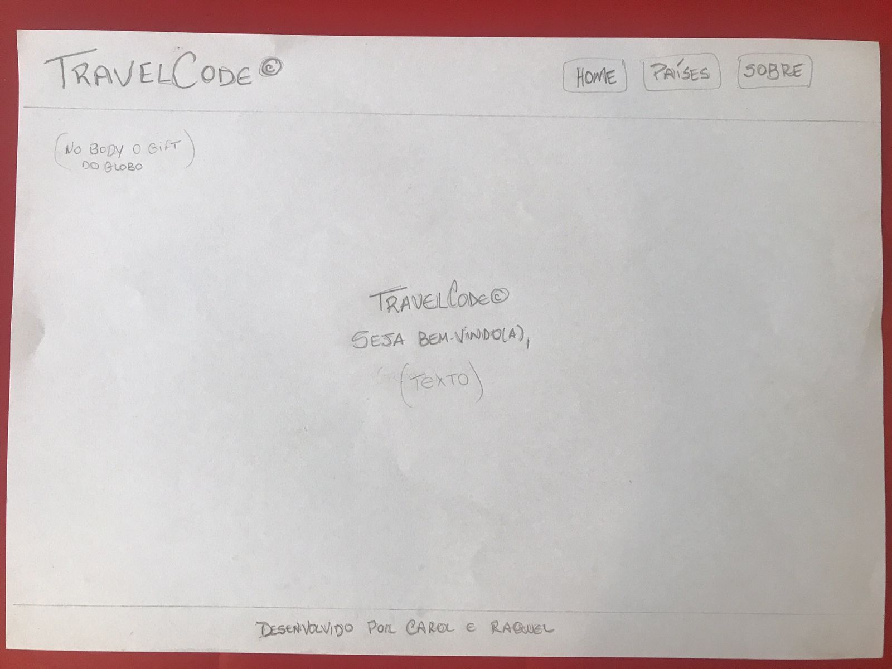
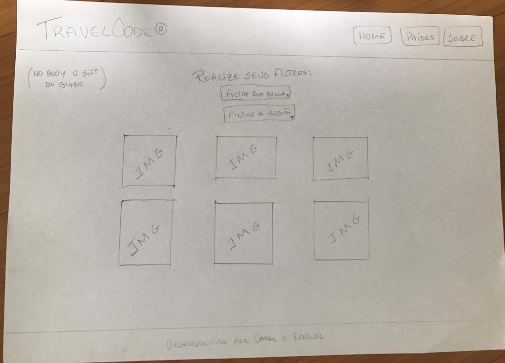
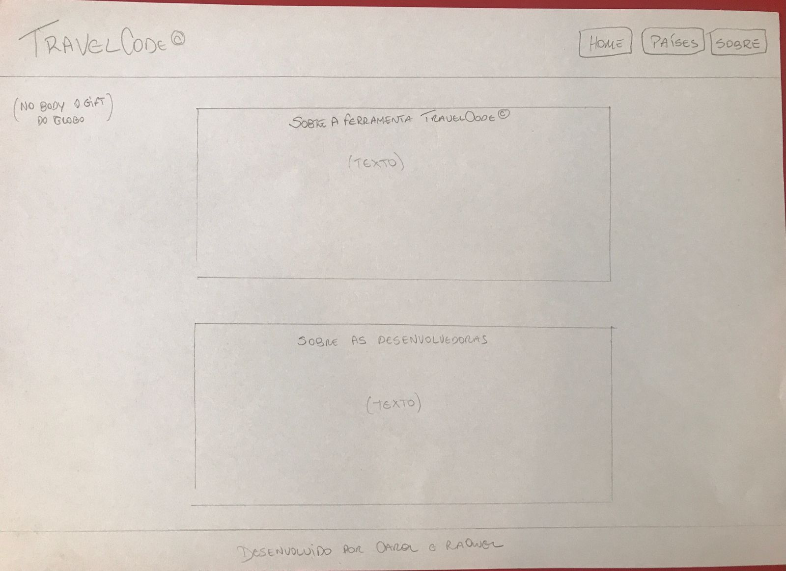
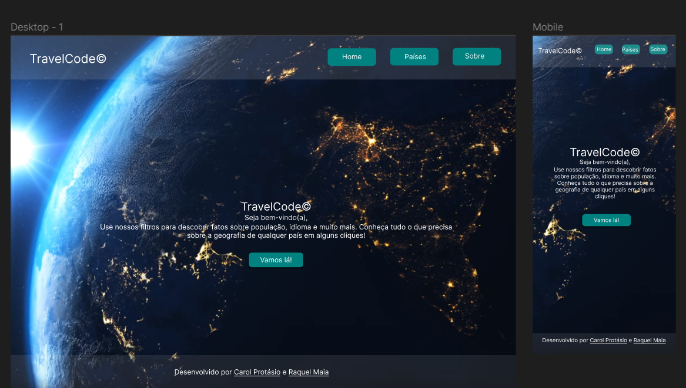
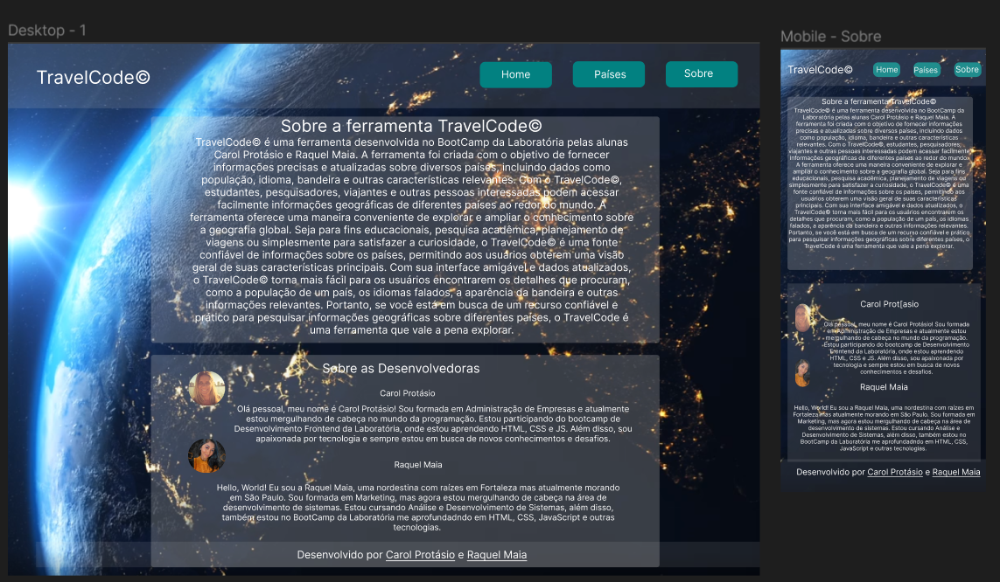

# Data Lovers

## Índice

* [1. Resumo do projeto](#1-resumo-do-projeto)
* [2. Usuários e suas necessidades](#2-usuário-e-suas-necessidades)
* [3. Protótipos](#3-protótipos)* 
* [4. Extra](#4-extra)

***

## 1. Resumo do projeto

TravelCode© é uma ferramenta desenvolvida no BootCamp da Laboratória pelas alunas Carol Protásio e Raquel Maia. A ferramenta foi criada com o objetivo de fornecer informações precisas e atualizadas sobre diversos países, incluindo dados como população, idioma, bandeira e outras características relevantes. Com o TravelCode©, estudantes, pesquisadores, viajantes e outras pessoas interessadas podem acessar facilmente informações geográficas de diferentes países ao redor do mundo. A ferramenta oferece uma maneira conveniente de explorar e ampliar o conhecimento sobre a geografia global.

Veja o projeto finalizado

## 2. Usuários e suas necessidades

Seja para fins educacionais, pesquisa acadêmica, planejamento de viagens ou simplesmente para satisfazer a curiosidade, o TravelCode© é uma fonte confiável de informações sobre os países, permitindo aos usuários obterem uma visão geral de suas características principais. Com sua interface amigável e dados atualizados, o TravelCode© torna mais fácil para os usuários encontrarem os detalhes que procuram, como a população de um país, os idiomas falados, a aparência da bandeira e outras informações relevantes. Portanto, se você está em busca de um recurso confiável e prático para pesquisar informações geográficas sobre diferentes países, o TravelCode é uma ferramenta que vale a pena explorar.

## 3. Protótipos 📝
Baixa fidelidade:

Alta fidelidade:

